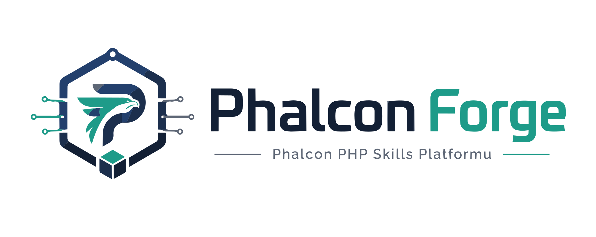

# Phalcon Forge



> **Phalcon PHP Skills Platformu**: Phalcon ekipleri için profesyonel, çok ajan uyumlu ve üretim odaklı starter-kit + dokümantasyon + MCP altyapısı.

[](.github/workflows/ci.yml)
[](docs/release-notes-v0.1.0.md)
[](starter-kits/)
[](docs/source-policy.md)

---

## Nedir?

Bu proje, Phalcon geliştiricilerinin aynı standartta çalışmasını sağlayan bir **uygulama hızlandırma platformudur**:

- Senaryo bazlı starter-kit ailesi (`basic`, `invo`, `rest`, `vokuro`)
- Resmî kaynaklara kilitli PhalconDocs index katmanı
- MCP tool sözleşmeleri + çalışan yerel runtime
- Cross-agent (Cursor / Claude / Codex) yönerge uyumluluğu
- Docker tabanlı hızlı ayağa kaldırma akışı

## Öne Çıkan Değer

- **Phalcon-first yaklaşım:** Yerleşik framework yetenekleri önceliklidir.
- **Kaynak güvenilirliği:** Sadece kilitli URL/branch kaynakları kullanılır.
- **Tek komut kalite kapısı:** CI ve release kontrol scriptleri hazırdır.
- **Kurumsal okunabilirlik:** Senaryo matrisi, runbook ve release checklist tek yerde.

---

## Proje Yapısı

```text
.
├─ skill/               # Politika, playbook, anti-rewrite kuralları
├─ starter-kits/        # basic | invo | rest | vokuro
├─ phalcondocs/         # Kaynak snapshot + index + build/sync scriptleri
├─ mcp-server/          # Tool sözleşmeleri + local runtime
├─ docker/              # Phalcon extension kurulumlu container yapısı
├─ agents/              # common policy + agent adapter belgeleri
├─ scripts/             # CI, smoke ve release kontrol scriptleri
└─ docs/                # Senaryo matrisi, runbook, release dokümanları
```

---

## Starter-Kit Kullanım Senaryoları

| Senaryo | Ne zaman seçilir? | Güçlü tarafı |
|---|---|---|
| `basic` | Hızlı başlangıç, düşük karmaşıklık | Minimal kurulum, hızlı MVP |
| `invo` | Domain odaklı iş akışları | Katmanlı mimari, genişletilebilirlik |
| `rest` | API-first servis geliştirme | JSON contract, validation akışı |
| `vokuro` | Auth/session odaklı projeler | Login/logout + session guard temeli |

Detaylı karar rehberi: `docs/scenario-matrix.md`

---

## Index ve Dokümantasyon Akışı

### 1) Kaynak Politikası (karışma yok)

- Resmî repo: `https://github.com/phalcon/documentation.git`
- Aktif branch: `5.9.x`, `5.11.x`
- Kural: `strict_url_only`, `allowInference=false`, `allowCrossVersionMerge=false`

Kaynak kuralları: `docs/source-policy.md`

### 2) PhalconDocs Index Dosyaları

- `phalcondocs/index/manifest.json`
- `phalcondocs/index/symbols.json`
- `phalcondocs/index/methods-by-category.json`
- `phalcondocs/index/scenarios.json`

### 3) Index Üretim Komutları

```bash
pwsh ./phalcondocs/scripts/sync-docs.ps1 -Version 5.9
pwsh ./phalcondocs/scripts/sync-docs.ps1 -Version 5.11
pwsh ./phalcondocs/scripts/build-index.ps1
```

---

## MCP Kullanım Senaryoları

MCP server, index verisini araçlar üzerinden erişilebilir hâle getirir:

- `get_starter_scenario` → senaryo seçimi
- `compare_scenarios` → mimari/güvenlik/deploy kıyaslama
- `get_methods_by_category` → kategori bazlı API envanteri
- `recommend_existing_phalcon_api` → mevcut Phalcon çözümü önerisi
- `doctor_runtime` → çalışma ortamı sağlık kontrolü

Yerel çalıştırma:

```bash
php mcp-server/server.php
```

---

## Hızlı Başlangıç

### 1) Ortam değişkenleri

```bash
cp .env.example .env
```

### 2) Kalite ve release durumu

```bash
pwsh ./scripts/ci-check.ps1
pwsh ./scripts/release-status.ps1
```

### 3) Docker ile ayağa kaldırma

```bash
docker compose -f docker/compose/docker-compose.yml up -d
docker compose -f docker/compose/docker-compose.yml -f docker/compose/rest/docker-compose.override.yml up -d
```

---

## Operasyon ve Release

- Runbook: `docs/runbook.md`
- Release checklist: `docs/release-v0.1-checklist.md`
- Release notes: `docs/release-notes-v0.1.0.md`
- Changelog: `CHANGELOG.md`

---

## Hedef Kitle

- Phalcon ile kurumsal standart oturtmak isteyen ekipler
- Çok ajanlı geliştirme ortamında tutarlılık arayan takımlar
- “Hızlı başla, kontrollü büyü” prensibiyle ilerleyen projeler